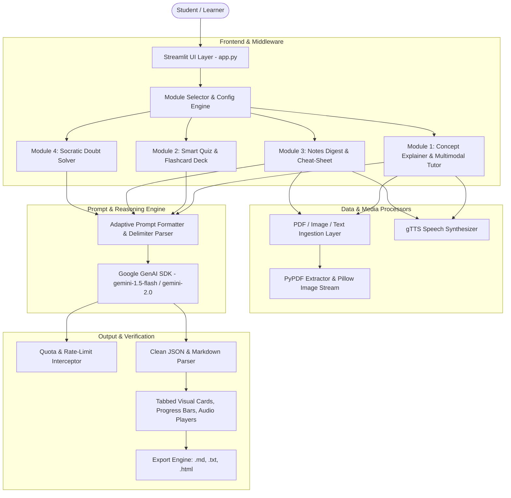

# EduGenie: Google Gemini Powered Learning Assistant
## Project Engineering & Architectural Specification Report

---

### 1. Executive Abstract & Problem Statement
Traditional digital education platforms often suffer from static curricula, one-size-fits-all explanations, and disconnected assessment workflows. Students struggling with nuanced STEM or humanities concepts either encounter explanations packed with impenetrable jargon or trivialized analogies that lack rigorous depth. 

**EduGenie** bridges this pedagogical gap by providing an end-to-end, multimodal, adaptive AI learning environment. Powered by **Google Gemini Large Language Models** (`gemini-1.5-flash`, `gemini-1.5-pro`, `gemini-2.0-flash-exp`) and **Streamlit**, EduGenie delivers calibrated conceptual breakdowns, multimodal diagram & textbook ingestion, auto-graded multiple-choice quizzes, active-recall flashcard decks, multi-format note summaries, and auditory speech synthesis for inclusive, multimodal revision.

---

### 2. System Architecture



---

### 3. Core Modules & Functional Specifications

#### 3.1 🎓 Adaptive Concept Explainer & Multimodal Tutor
- **Audience Calibration:** Dynamically adjusts explanation tone, complexity, and vocabulary across 4 tiers: *ELI5*, *Beginner/High School*, *Undergraduate*, and *Industry Professional*.
- **Multimodal Visual & Document Ingestion:** Supports uploading diagrams, textbook pages (`.png`, `.jpg`), and syllabus PDFs (`.pdf`).
- **Layered Tab Output:** Deconstructs abstract concepts into:
  1. 💡 Core Intuition
  2. 🔍 Deep Mechanism Breakdown
  3. 🌟 Real-World Analogy
  4. 🛠️ Industry Applications
  5. ❓ Self-Check Quiz
- **Auditory Synthesis:** Inbuilt text-to-speech engine using `gTTS` for auditory learning.

#### 3.2 ❓ Smart Quiz & Active Recall Flashcards
- **Interactive MCQ Engine:** Automatically outputs structured JSON parsed into radio button selectors with real-time grading, visual score meters (`st.progress`), and granular explanations.
- **Active Recall Flashcards:** Generates 2-sided expandable flashcards for targeted memory retention.

#### 3.3 📝 Multimodal Notes Digest & Revision Cheat-Sheets
- **High-Density Condenser:** Processes up to 12,000+ characters of lecture transcripts or textbook chapters.
- **Structured Sections:** Generates high-level executive overviews, glossary dictionaries, mechanisms, and exam cheat-sheets.
- **Multi-Format Export:** Instant export to Markdown (`.md`), Plain Text (`.txt`), and Printable Styled HTML (`.html`).

#### 3.4 💬 Socratic Doubt Solver (Interactive Chat)
- **Stateful Multi-Turn Context:** Uses `model.start_chat(history=...)` with persistent memory across questions.
- **Quick Suggestion Chips:** One-tap prompts for step-by-step math breakdowns, intuitive analogies, and common student mistake warnings.

---

### 4. Prompt Engineering & Reliability Strategy

1. **Strict JSON Schema Enforcement for Structured Data:**
   - Quizzes and flashcards utilize explicit schema declarations with zero-shot delimiter constraints to prevent malformed responses:
     ```
     Respond ONLY with a valid JSON array of objects with keys: id, question, options, correct_answer, explanation.
     ```
   - Automated `clean_json_response()` strips markdown fences (` ```json `) to guarantee error-free `json.loads()` parsing.

2. **Delimiter-Based Section Parsing:**
   - Long-form explanations utilize unambiguous tokens (`[SECTION: Core Intuition]`, `[SECTION: Deep Breakdown]`) which allow the Streamlit frontend to slice responses cleanly into interactive UI tabs.

3. **Rate Limit & Fault Interception:**
   - `handle_gemini_error()` intercepts HTTP 429 Quota Exceeded and HTTP 403 Invalid Key errors, offering actionable suggestions (e.g., auto-recommending `gemini-1.5-flash`).

---

### 5. Impact & Future Roadmap
- **Multilingual Regional Voice Support:** Integration with regional Indian and global languages for localized learning.
- **LMS & Canvas/Google Classroom Integration:** Direct export of quiz results to institutional gradebooks.
- **Vector Search RAG:** Indexing entire semester textbook libraries using Gemini embeddings for pinpoint syllabus retrieval.
